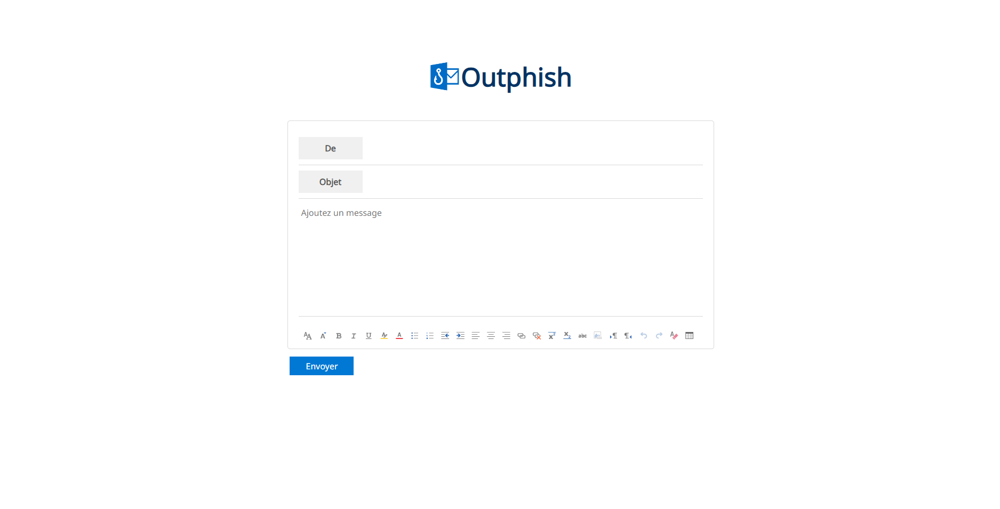

# Outphish

Une application simple et efficace pour détecter les e-mails de phishing grâce à l'intelligence artificielle.

## Fonctionnalités
- Analyse des e-mails pour détecter les caractéristiques de phishing.
- Utilisation d'un modèle de régression logistique pour évaluer les risques.
- Interface utilisateur intuitive pour charger les e-mails.

## Aperçu

# Installation

You can clone the repository to your local machine and begin the installation process.
Simply follow the instructions provided in the README.txt file.

This project is designed to work on Microsoft Azure, but you can also run it locally by following the steps outlined in README.txt. Both methods of usage are detailed in the instructions.

## Utilisation
1. Chargez un e-mail en texte brut ou en format .eml.
2. Cliquez sur "Envoyer".
3. Consultez le résultat des prédictions (Une prediction pour le contenu et une autre pour l'éxpediteur)

## Fonctionnement technique
- Le modèle est entraîné sur des données d'e-mails étiquetés comme "phishing" ou "légitimes".
- Caractéristiques utilisées : mots-clés, URL suspectes, longueur de l'e-mail, etc.
- Bibliothèque utilisée : `scikit-learn`.
- Algorithme : Régression logistique pour la classification binaire.

## Jeux de données
Les données d'entraînement proviennent de :
- [Kaggle - Phishing Websites Dataset](https://www.kaggle.com/).
- Données personnalisées générées via des e-mails simulés.
Ces données peuvent être retrouvées dans les fichiers du projet