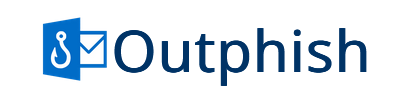

Outphish is an application that will help you detect phishing emails.

# Installation

You can clone the repository to your local machine and begin the installation process.
Simply follow the instructions provided in the README.txt file.

This project is designed to work on Microsoft Azure, but you can also run it locally by following the steps outlined in README.txt. Both methods of usage are detailed in the instructions.
